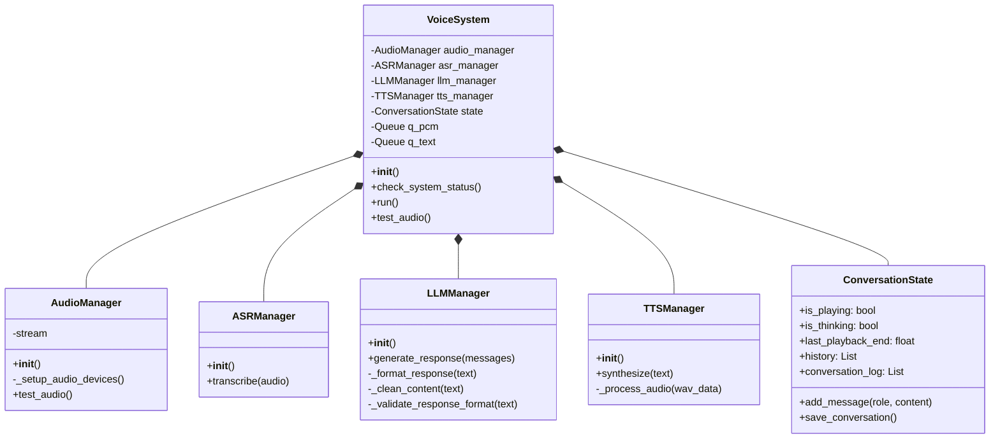
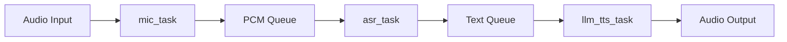

# Voice Interaction System - Class Design Document

## System Architecture Overview

This voice interaction system adopts a modular design, consisting of the following core components:

1. Main System Class (`VoiceSystem`)
2. Audio Manager (`AudioManager`)
3. Speech Recognition Manager (`ASRManager`)
4. Large Language Model Manager (`LLMManager`)
5. Text-to-Speech Manager (`TTSManager`)
6. Conversation State Manager (`ConversationState`)

## Class Diagram



## Core Class Details

### 1. VoiceSystem (Main System Class)
- **Responsibility**: Core controller of the entire voice interaction system
- **Main Functions**:
  - System initialization and status checking
  - Coordination of subsystem operations
  - Management of asynchronous task execution
- **Key Methods**:
  - `check_system_status()`: Check status of system components
  - `run()`: Start system main loop
  - `test_audio()`: Test audio devices

### 2. AudioManager
- **Responsibility**: Manage audio input/output devices
- **Main Functions**:
  - Audio device initialization and configuration
  - Audio stream management
  - Audio testing functionality
- **Key Attributes**:
  - `stream`: Audio stream object
- **Key Methods**:
  - `_setup_audio_devices()`: Set up audio devices
  - `test_audio()`: Test audio functionality

### 3. ASRManager (Speech Recognition Manager)
- **Responsibility**: Handle speech-to-text functionality
- **Main Functions**:
  - Speech recognition model loading and management
  - Audio to text processing
- **Key Methods**:
  - `transcribe(audio)`: Convert audio to text

### 4. LLMManager (Large Language Model Manager)
- **Responsibility**: Handle natural language understanding and generation
- **Main Functions**:
  - Large language model loading and management
  - Dialogue generation and response processing
  - Response quality control
- **Key Methods**:
  - `generate_response(messages)`: Generate dialogue responses
  - `_format_response(text)`: Format response text
  - `_validate_response_format(text)`: Validate response format

### 5. TTSManager (Text-to-Speech Manager)
- **Responsibility**: Handle text-to-speech functionality
- **Main Functions**:
  - Speech synthesis model management
  - Text to speech processing
  - Audio post-processing
- **Key Methods**:
  - `synthesize(text)`: Convert text to speech
  - `_process_audio(wav_data)`: Process audio data

### 6. ConversationState
- **Responsibility**: Manage conversation state and history
- **Main Functions**:
  - Conversation history management
  - State flag management
  - Conversation log saving
- **Key Attributes**:
  - `is_playing`: Whether audio is currently playing
  - `is_thinking`: Whether system is processing response
  - `history`: Conversation history
- **Key Methods**:
  - `add_message(role, content)`: Add conversation message
  - `save_conversation()`: Save conversation log

## Asynchronous Task Design

The system contains three main asynchronous tasks:

1. **mic_task**
   - Responsible for continuous audio input monitoring
   - Implements voice activity detection
   - Manages recording buffer

2. **asr_task**
   - Handles speech recognition
   - Implements duplicate recognition detection
   - Text validity validation

3. **llm_tts_task**
   - Handles language model response generation
   - Manages speech synthesis
   - Controls audio playback

## Data Flow



## Error Handling Mechanism

The system implements multi-layer error handling:

1. **System-level Error Handling**
   - Device initialization errors
   - System status checks
   - Graceful exit mechanism

2. **Task-level Error Handling**
   - Audio processing errors
   - Recognition errors
   - Model response errors

3. **Recovery Mechanism**
   - Automatic retry mechanism
   - State reset
   - Log recording

## Configuration Management

System configuration is centrally managed through `config.py`, including:

- Audio parameter configuration
- Model parameter settings (LLM model)
- System behavior configuration
- Output settings
- ASR configuration (using Whisper)

## Required Files and Directories

The system requires the following structure:

```
project/
├── models/
│   └── llama/           # LLM model files
├── output/              # Output directory for logs and recordings
└── config.py            # System configuration
```

Key requirements:
- LLM model file must be present in the models/llama directory
- Output directory must exist or will be created automatically
- Configuration file must be properly set up

## Extensibility Design

The modular system design supports the following extensions:

1. **Model Replacement**
   - Support for replacing speech recognition model
   - Support for replacing language model
   - Support for replacing speech synthesis model

2. **Feature Extension**
   - Support for adding new processing tasks
   - Support for expanding dialogue capabilities
   - Support for adding new input/output methods

## Performance Optimization

The system implements multiple performance optimization measures:

1. **Concurrent Processing**
   - Use of asynchronous task processing
   - Use of thread pools for compute-intensive tasks

2. **Resource Management**
   - Intelligent management of conversation history length
   - Optimization of audio buffer usage
   - Implementation of automatic resource release

3. **Response Optimization**
   - Implementation of voice activity detection
   - Optimization of response generation speed
   - Audio processing optimization 